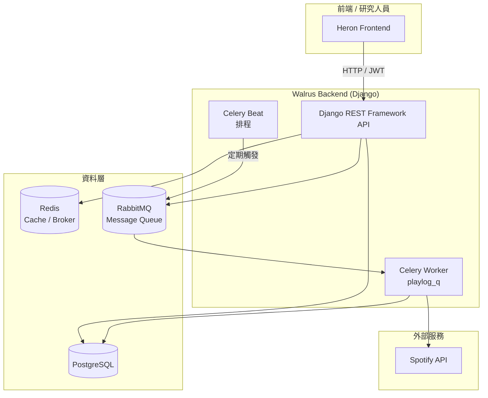
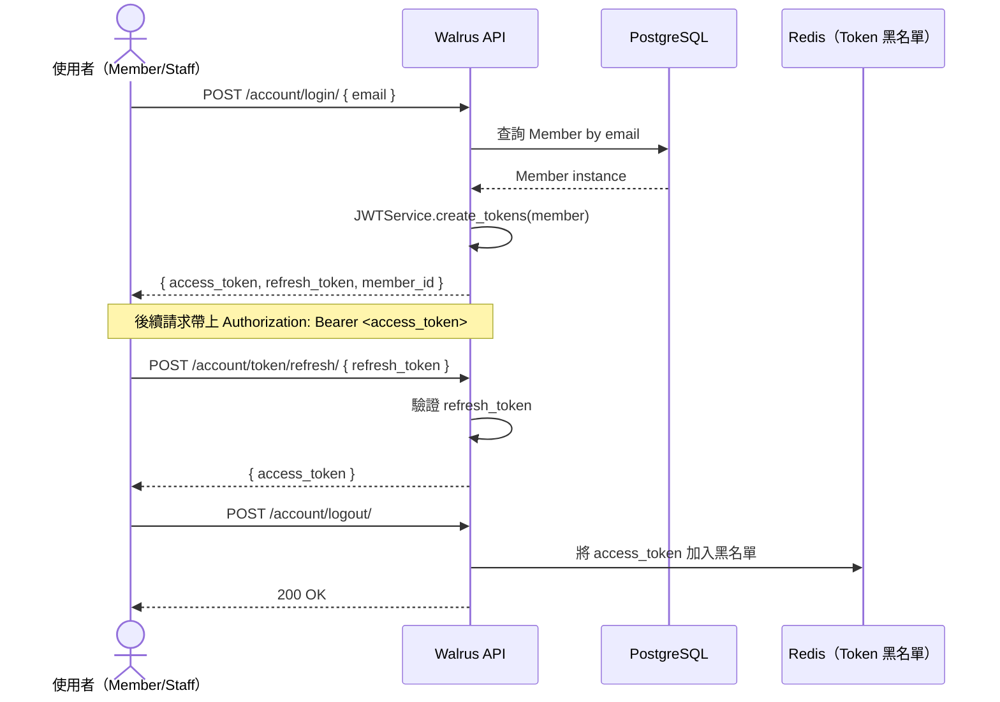
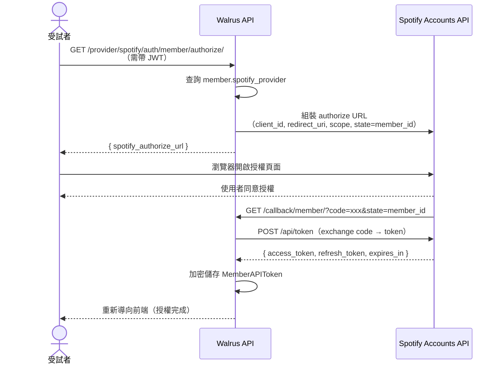
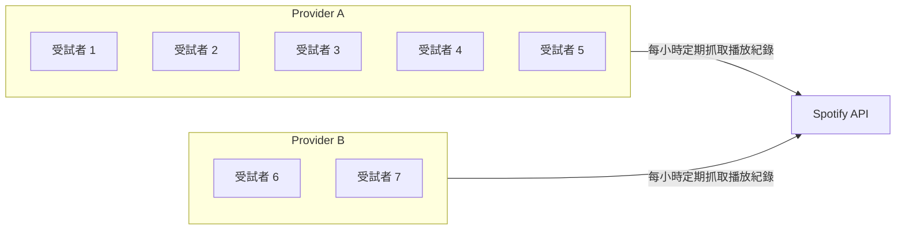
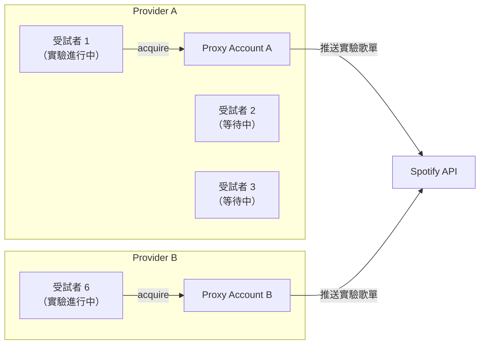
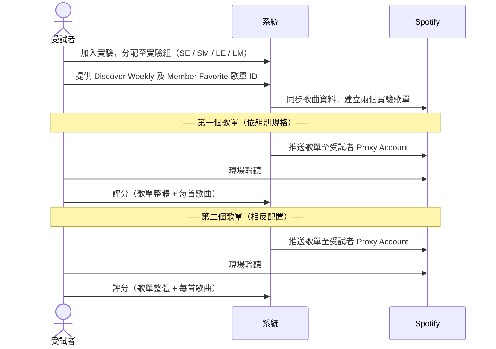

# 🐋 Walrus — Familiarity Playlist 實驗後端

> 探討「熟悉度」對音樂播放清單滿意度的影響 — 以 Spotify 平台為基礎的控制實驗系統

---

## 目錄

- [專案簡介](#專案簡介)
- [系統架構](#系統架構)
- [模組說明](#模組說明)
- [授權流程](#授權流程)
- [實驗設計](#實驗設計)
- [歌單建立邏輯](#歌單建立邏輯)
- [技術棧](#技術棧)
- [快速啟動](#快速啟動)
- [背景排程任務](#背景排程任務)

---

## 專案簡介

**Walrus** 是一個研究型後端系統，旨在驗證以下假設：

> _播放清單中「熟悉歌曲」的數量與位置，是否會影響使用者對整張歌單的滿意度？_

系統透過 Spotify API 整合，為每位受試者自動生成具有不同「長度」與「熟悉歌曲排列位置」的實驗歌單，並收集評分數據，作為後續分析的依據。

---

## 系統架構



---

## 模組說明

### 各模組職責

| 模組 | 主要模型 | 職責 |
|------|---------|------|
| `account` | `Member`, `ExperimentGroup` | 受試者管理、實驗分組 |
| `playlist` | `Playlist`, `PlaylistTrack` | 實驗歌單建立與評分 |
| `track` | `Track`, `Artist`, `Genre`, `TrackAudioFeatures` | 歌曲基本資料與音樂特徵 |
| `listening_profile` | `HistoryPlayLog`, `HistoryPlayLogContext` | Spotify 播放紀錄收集 |
| `provider` | `Provider`, `MemberAPIToken`, `ProviderProxyAccount` | Spotify OAuth2 整合、Token 管理 |

---

## 授權流程

系統有兩套獨立的授權機制：**JWT（系統登入）** 與 **Spotify OAuth2（資料存取）**。

### 1. 系統登入（JWT）



### 2. Spotify OAuth2（受試者綁定）

每位受試者需授權 Walrus 存取其 Spotify 帳號，以便：
- 匯入 Discover Weekly / Member Favorite 歌單
- 定期收集播放紀錄（Listening History）



> **Token 加密**：`access_token` 與 `refresh_token` 以對稱加密（AES）儲存於資料庫，避免明文洩漏。

### 3. Spotify Proxy Account（播放帳號）

實驗分為兩個階段，對 Spotify App 的使用限制不同：

| 階段 | 說明 | 一個 App 的限制 |
|------|------|--------------|
| **Phase 1 — 聆聽紀錄收集** | 受試者以自身帳號授權，系統定期抓取播放紀錄 | 最多同時收集 **5 人**份 |
| **Phase 2 — 現場實驗聆聽** | 受試者 acquire 系統的 Proxy Account，透過該帳號收聽實驗歌單 | 一次只能服務 **1 人** |

系統建立多組 `Provider`（各自對應一個獨立 Spotify App），每個 Provider 只對應一個 `ProviderProxyAccount`。

**Phase 1 — 聆聽紀錄收集**（一個 App 最多同時服務 5 位受試者）



**Phase 2 — 現場實驗聆聽**（一個 App 的 Proxy Account 一次只能服務 1 位受試者）



---

## 實驗設計

每位受試者會依序聆聽**兩個歌單**，組別代碼描述的是第一個歌單的特性，第二個歌單則為相反配置：

| 組別 | 第一個歌單 | 第二個歌單 |
|------|-----------|-----------|
| **SE** | 短歌單，喜愛歌曲在邊緣 | 長歌單，喜愛歌曲在中間 |
| **SM** | 短歌單，喜愛歌曲在中間 | 長歌單，喜愛歌曲在邊緣 |
| **LE** | 長歌單，喜愛歌曲在邊緣 | 短歌單，喜愛歌曲在中間 |
| **LM** | 長歌單，喜愛歌曲在中間 | 短歌單，喜愛歌曲在邊緣 |

兩個變數（歌單長度、喜愛歌曲位置）各自在兩個歌單之間交叉對調，確保每位受試者都體驗過所有組合，同時組別間的順序效應可被抵消。

### 實驗流程



---

## 歌單建立邏輯

### 歌單規格

| 歌單類型 | 總歌曲數 | 熟悉歌曲數 | 熟悉歌曲位置（1-indexed） |
|---------|---------|----------|----------------------|
| 短 + 邊緣 | 10 首 | 4 首 | 1, 2, 9, 10 |
| 短 + 中間 | 10 首 | 4 首 | 4, 5, 6, 7 |
| 長 + 邊緣 | 20 首 | 6 首 | 1, 2, 3, 18, 19, 20 |
| 長 + 中間 | 20 首 | 6 首 | 8, 9, 10, 11, 12, 13 |

### 歌曲分配策略（避免重複）

為確保 Phase 1 和 Phase 2 的歌曲來源不重疊，系統依照來源歌單的 order 奇偶數分配：

- **Phase 1** 優先取奇數位置（order 1, 3, 5, 7...）
- **Phase 2** 優先取偶數位置（order 2, 4, 6, 8...）
- 若某 phase 需要的歌曲數超過可用的奇/偶數數量，則從兩邊的分界點之後連續補充

```
來源歌單  [ 1 ][ 2 ][ 3 ][ 4 ][ 5 ][ 6 ][ 7 ][ 8 ][ 9 ][ 10 ]...
            │         │         │         │         │
Phase 1   [ 1 ]     [ 3 ]     [ 5 ]     [ 7 ]     [ 9 ]   ← 奇數位置
                 │         │         │         │
Phase 2        [ 2 ]     [ 4 ]     [ 6 ]     [ 8 ]         ← 偶數位置
```

每首歌只會出現在其中一個 phase。採用交錯取法而非連續切割（前半給 Phase 1、後半給 Phase 2），是為了確保兩個 phase 分配到的喜愛歌曲在喜好程度上盡量相近，避免因為歌曲本身的喜好程度落差影響實驗結果。

### 來源歌單需求

| 來源歌單 | 最少歌曲數 | 說明 |
|---------|----------|------|
| MEMBER_FAVORITE | 12 首 | LONG 組需 6 首熟悉歌曲，取偶數 order 需 12 首 |
| DISCOVER_WEEKLY | 20 首 | LONG 組扣除 MIDDLE 後需 14 首，取偶數 order 最多需 20 首 |

---

## 技術棧

| 類別 | 技術 |
|------|------|
| 後端框架 | Django 5.2 + Django REST Framework |
| 資料庫 | PostgreSQL 14 |
| 快取 / Broker | Redis 7 |
| 訊息佇列 | RabbitMQ 3 |
| 非同步任務 | Celery |
| 外部 API | Spotify Web API（OAuth2） |
| 容器化 | Docker / Docker Compose |
| CI/CD | Drone CI |
| 認證 | JWT（SimpleJWT） |

---

## 快速啟動

### 前置需求

- Docker & Docker Compose
- 準備好 Spotify Developer App（Client ID / Secret）

### 本地開發

```bash
# 複製環境變數範本
cp env/walrus-local.env.secret.example env/walrus-local.env.secret

# 填入必要的環境變數（Spotify credentials、Django secret key 等）
vim env/walrus-local.env.secret

# 啟動所有服務
docker compose -f backend-local.yml up -d

# 確認服務狀態
docker compose -f backend-local.yml ps
```

服務啟動後，系統會自動執行：
1. `migrate` — 資料庫遷移
2. `loaddata account/fixtures/experiment_group.json` — 載入四個實驗組別
3. `register_periodic_tasks` — 註冊 Celery 定期任務
4. `gunicorn` — 啟動 API 伺服器（`http://localhost:8000`）

---

## 背景排程任務

```mermaid
gantt
    title Celery Beat 排程（24 小時週期）
    dateFormat HH:mm
    axisFormat %H:%M

    section 播放紀錄
    collect-all-members-recently-played-logs :00:00, 1h
    collect-all-members-recently-played-logs :01:00, 1h
    collect-all-members-recently-played-logs :02:00, 1h

    section 藝人資料
    check-and-update-missing-artist-details :00:00, 4h
    check-and-update-missing-artist-details :04:00, 4h

    section 歌單 Context
    check-and-update-missing-playlist-context :01:30, 4h
    check-and-update-missing-playlist-context :05:30, 4h
```



| 任務名稱 | 執行頻率 | 說明 |
|---------|---------|------|
| `collect_all_members_recently_played_logs` | 每小時整點 | 從 Spotify 收集所有受試者的播放紀錄 |
| `check_and_update_missing_artist_details` | 每 4 小時（0, 4, 8...） | 補齊缺失的藝人詳細資料 |
| `check_and_update_missing_playlist_context_details` | 每 4 小時（1:30, 5:30...） | 補齊缺失的歌單 Context 詳細資料 |
